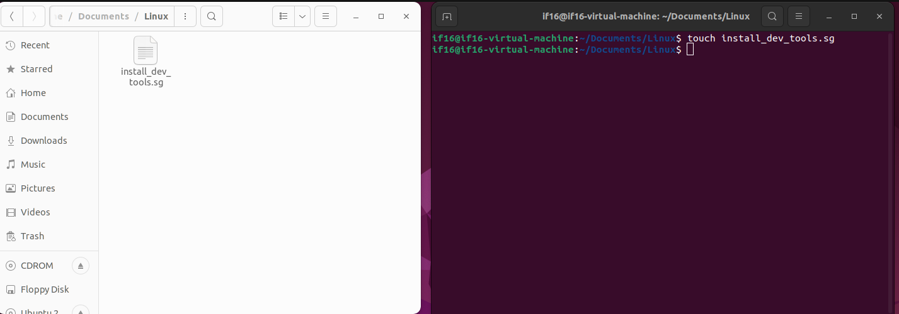
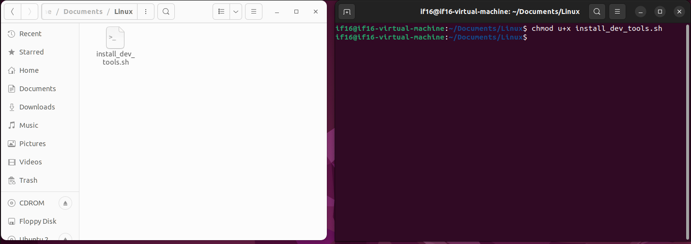
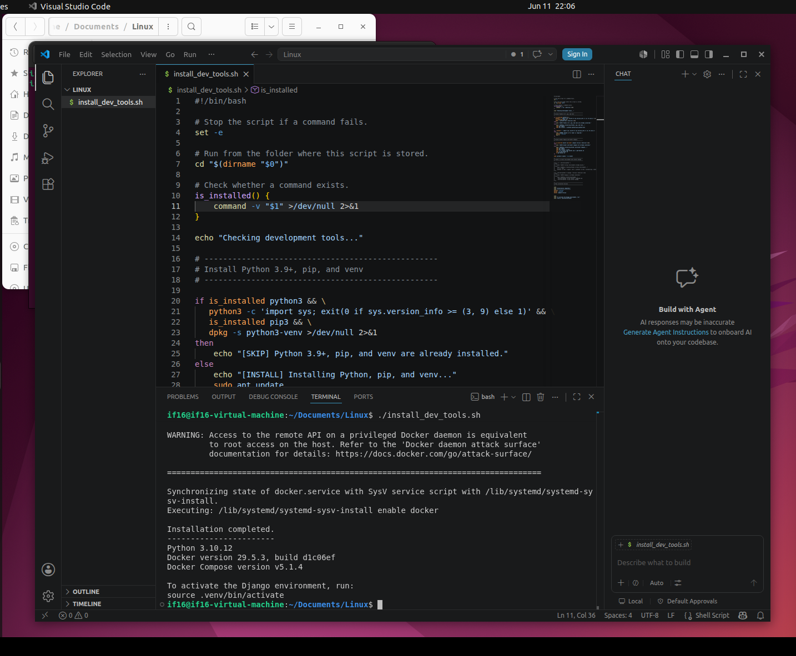

# Linux Administration — Homework 3

## Task Overview

This project contains a Bash script (`install_dev_tools.sh`) that automates the installation of essential DevOps development tools on Ubuntu/Debian-based Linux systems. The script installs:

- **Docker** — container platform
- **Docker Compose** — multi-container orchestration tool
- **Python 3.9+** — programming language runtime
- **Django** — Python web framework (installed via `pip` inside a virtual environment)

The script checks whether each tool is already installed before attempting installation, preventing duplicate work.

---

## Repository Structure

```
Linux/
└── install_dev_tools.sh
```

---

## Script Details

### Shebang and Safety Settings

```bash
#!/bin/bash
set -e
cd "$(dirname "$0")"
```

- `#!/bin/bash` — declares the script interpreter.
- `set -e` — causes the script to exit immediately if any command fails, preventing silent errors.
- `cd "$(dirname "$0")"` — ensures the script always runs from the directory where it is located, regardless of where it is called from.

### Helper Function: `is_installed`

```bash
is_installed() {
    command -v "$1" >/dev/null 2>&1
}
```

This reusable function checks whether a given command (tool) exists on the system. It suppresses all output and returns a boolean exit code. Used throughout the script to avoid reinstalling tools that are already present.

### Python, pip, and venv Check

```bash
if is_installed python3 && \
    python3 -c 'import sys; exit(0 if sys.version_info >= (3, 9) else 1)' && \
    is_installed pip3 && \
    dpkg -s python3-venv >/dev/null 2>&1
then
    echo "[SKIP] Python 3.9+, pip, and venv are already installed."
else
    echo "[INSTALL] Installing Python, pip, and venv..."
    sudo apt update
    ...
fi
```

Before installing Python, the script:
1. Confirms `python3` exists.
2. Verifies the version is 3.9 or higher using a one-liner Python check.
3. Confirms `pip3` is available.
4. Checks that the `python3-venv` package is installed via `dpkg`.

Only if any of these checks fail does the script proceed with installation.

---

## How to Use

### Step 1 — Create the script file

```bash
touch install_dev_tools.sh
```

The file `install_dev_tools.sh` was created in the `~/Documents/Linux` directory using the `touch` command. The file manager on the left confirms the file appeared in the folder.



### Step 2 — Make the script executable

```bash
chmod u+x install_dev_tools.sh
```

After running `chmod u+x`, the file icon in the file manager changed from a plain document icon to a terminal/executable icon, confirming the permission was applied successfully.



### Step 3 — Run the script

```bash
./install_dev_tools.sh
```

The script was opened in VS Code and executed from the integrated terminal. The terminal output shows:

- A Docker daemon warning (expected — informational only, not an error).
- Docker service synchronization messages.
- `Installation completed.`
- Installed versions confirmed:
  - **Python 3.10.12**
  - **Docker version 29.5.3**, build d1c06ef
  - **Docker Compose version v5.1.4**
- A reminder to activate the virtual environment:
  ```
  To activate the Django environment, run:
  source .venv/bin/activate
  ```



---

## Verified Installed Versions

| Tool           | Version        |
|----------------|----------------|
| Python         | 3.10.12        |
| Docker         | 29.5.3         |
| Docker Compose | v5.1.4         |
| Django         | installed via pip in `.venv` |

---

## Git Workflow

The script was pushed to the `lesson-3` branch using the following commands:

```bash
git checkout -b lesson-3
git add install_dev_tools.sh
git commit -m "Add Bash script for installing Docker, Docker Compose, Python, and Django"
git push origin lesson-3
```

---

## Requirements

- Ubuntu / Debian-based Linux system
- `sudo` privileges (required for `apt` and Docker installation)
- Internet connection

---

## Notes

- Django is installed inside a Python virtual environment (`.venv`) to keep the system Python clean.
- To use Django after installation, activate the virtual environment first:
  ```bash
  source .venv/bin/activate
  ```
- The script is idempotent — running it multiple times is safe; already-installed tools are skipped with a `[SKIP]` message.