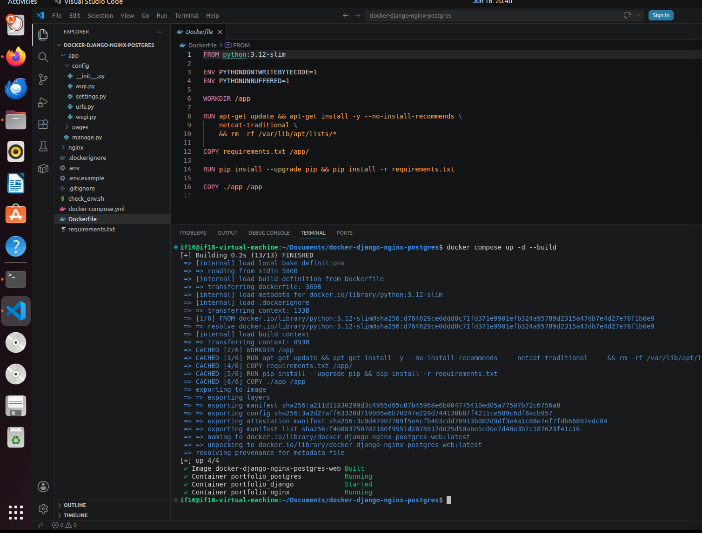
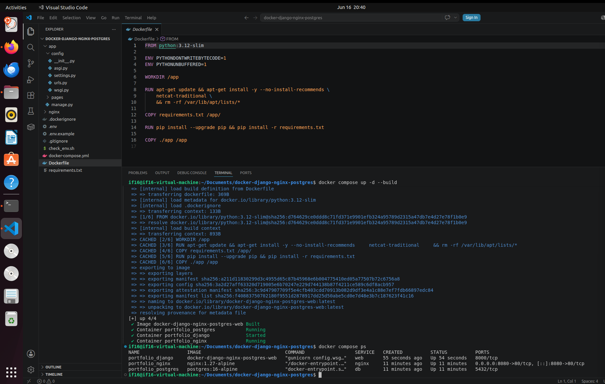
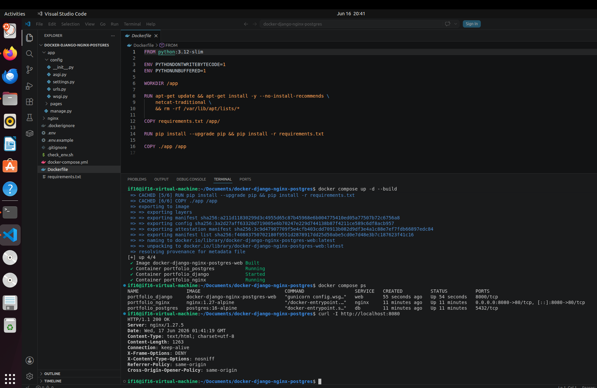
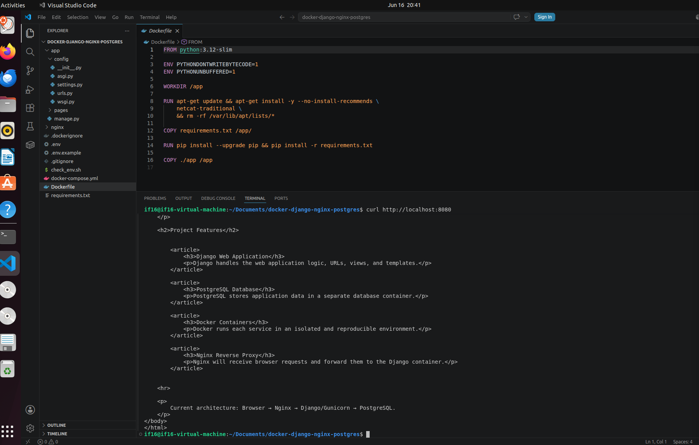
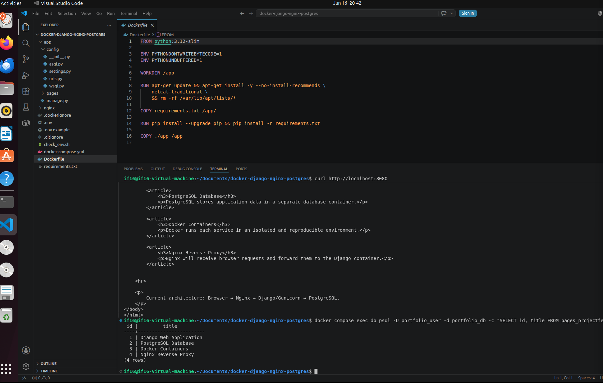
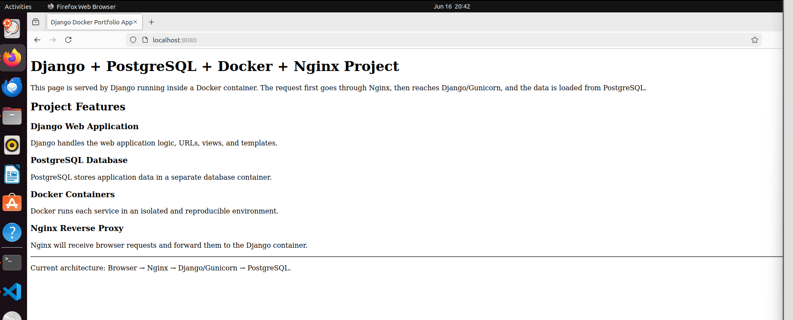

# Django + PostgreSQL + Docker + Nginx Project

## Project Overview

This project is a simple multi-container web application built with Django, PostgreSQL, Docker, Docker Compose, Gunicorn, and Nginx.

The purpose of this project is to demonstrate how to containerize a Django application, connect it to a PostgreSQL database, and serve it through an Nginx reverse proxy.

The application displays a simple web page with project features loaded from a PostgreSQL database.

## Technologies Used

* Python
* Django
* PostgreSQL
* Docker
* Docker Compose
* Gunicorn
* Nginx
* Linux Ubuntu

## Application Architecture

The project uses the following request flow:

```text
Browser → Nginx → Django/Gunicorn → PostgreSQL
```

Service responsibilities:

```text
Nginx       - receives browser requests on port 8080
Django      - handles application logic, views, templates, and database queries
Gunicorn    - runs the Django application inside the container
PostgreSQL  - stores application data
Docker      - runs each service in an isolated container
```

## Project Structure

```text
docker-django-nginx-postgres/
├── app/
│   ├── config/
│   │   ├── settings.py
│   │   ├── urls.py
│   │   ├── wsgi.py
│   │   └── asgi.py
│   ├── pages/
│   │   ├── migrations/
│   │   ├── templates/
│   │   │   └── pages/
│   │   │       └── home.html
│   │   ├── models.py
│   │   ├── urls.py
│   │   └── views.py
│   └── manage.py
├── nginx/
│   └── default.conf
├── screenshots/
│   ├── 01-docker-build.png
│   ├── 02-running-containers.png
│   ├── 03-nginx-response.png
│   ├── 04-html-response.png
│   ├── 05-postgres-data.png
│   └── 06-browser-page.png
├── .dockerignore
├── .env.example
├── .gitignore
├── Dockerfile
├── docker-compose.yml
├── requirements.txt
└── README.md
```

## Prerequisites

Before running this project, install the following tools:

* Git
* Docker Engine
* Docker Compose plugin

Check that Docker is installed:

```bash
docker --version
```

Check that Docker Compose is installed:

```bash
docker compose version
```

Important: this project uses the modern Docker Compose command:

```bash
docker compose
```

not the old command:

```bash
docker-compose
```

## Step-by-Step Setup Guide

### 1. Clone the Repository

```bash
git clone <your-repository-url>
cd docker-django-nginx-postgres
```

### 2. Create the Environment File

Copy the example environment file:

```bash
cp .env.example .env
```

The `.env` file contains local environment variables for Django and PostgreSQL.

Example:

```env
POSTGRES_DB=portfolio_db
POSTGRES_USER=portfolio_user
POSTGRES_PASSWORD=change_this_password
POSTGRES_HOST=db
POSTGRES_PORT=5432

DJANGO_SECRET_KEY=change-this-secret-key
DJANGO_DEBUG=True
DJANGO_ALLOWED_HOSTS=localhost,127.0.0.1
```

The `.env` file should not be committed to GitHub because it may contain private settings and passwords.

### 3. Build and Start the Containers

Run:

```bash
docker compose up -d --build
```

This command builds the Django image and starts all services in the background.

The project starts three containers:

```text
portfolio_django
portfolio_nginx
portfolio_postgres
```

### 4. Check Running Containers

Run:

```bash
docker compose ps
```

Expected result:

```text
portfolio_django     Up
portfolio_nginx      Up
portfolio_postgres   Up
```

Nginx should expose the application on port `8080`.

### 5. Apply Django Migrations

Run:

```bash
docker compose exec web python manage.py migrate
```

This command creates the required Django tables inside PostgreSQL.

### 6. Add Sample Data

Run:

```bash
docker compose exec web python manage.py shell -c "
from pages.models import ProjectFeature

ProjectFeature.objects.all().delete()

ProjectFeature.objects.create(
    title='Django Web Application',
    description='Django handles the web application logic, URLs, views, and templates.'
)

ProjectFeature.objects.create(
    title='PostgreSQL Database',
    description='PostgreSQL stores application data in a separate database container.'
)

ProjectFeature.objects.create(
    title='Docker Containers',
    description='Docker runs each service in an isolated and reproducible environment.'
)

ProjectFeature.objects.create(
    title='Nginx Reverse Proxy',
    description='Nginx receives browser requests and forwards them to the Django container.'
)

print('Database records created:', ProjectFeature.objects.count())
"
```

Expected result:

```text
Database records created: 4
```

### 7. Open the Web Application

Open this URL in the browser:

```text
http://localhost:8080
```

The page should display:

```text
Django + PostgreSQL + Docker + Nginx Project
```

The page should also show project features loaded from PostgreSQL.

## Commands Used to Demonstrate That the Project Works

The following commands were used to verify that the project works correctly.

### 1. Start the Project

```bash
docker compose up -d --build
```

Purpose:

```text
Builds the Docker image and starts the Django, PostgreSQL, and Nginx containers.
```

### 2. Check Running Containers

```bash
docker compose ps
```

Purpose:

```text
Shows that all required containers are running.
```

Expected containers:

```text
portfolio_django
portfolio_nginx
portfolio_postgres
```

### 3. Check Nginx HTTP Response

```bash
curl -I http://localhost:8080
```

Purpose:

```text
Confirms that Nginx is responding to HTTP requests.
```

Expected result:

```text
HTTP/1.1 200 OK
Server: nginx
```

### 4. Check Web Page HTML Response

```bash
curl http://localhost:8080
```

Purpose:

```text
Confirms that Nginx forwards the request to Django and Django returns the HTML page.
```

Expected page content:

```html
<h1>Django + PostgreSQL + Docker + Nginx Project</h1>
```

### 5. Check PostgreSQL Data

```bash
docker compose exec db psql -U portfolio_user -d portfolio_db -c "SELECT id, title FROM pages_projectfeature;"
```

Purpose:

```text
Confirms that PostgreSQL stores the application data used by Django.
```

Expected result:

```text
1 | Django Web Application
2 | PostgreSQL Database
3 | Docker Containers
4 | Nginx Reverse Proxy
```

### 6. Open the Application in Browser

Open:

```text
http://localhost:8080
```

Purpose:

```text
Confirms visually that the web application works in the browser.
```

## Homework Report

For this homework assignment, I created a multi-container Django project using Docker Compose.

The project includes:

```text
Django web application container
PostgreSQL database container
Nginx reverse proxy container
```

The Django application is served by Gunicorn. Nginx receives browser requests on port `8080` and forwards them to the Django container on port `8000`. Django connects to PostgreSQL and displays database records on the web page.

This setup demonstrates how Docker Compose can be used to run a real web application with separate services for the application, database, and web server.

## Screenshots

### Screenshot 1 — Docker Build and Start Command

This screenshot shows the command used to build and start the project containers.
# Django + PostgreSQL + Docker + Nginx Project

## Project Overview

This project is a simple multi-container web application built with Django, PostgreSQL, Docker, Docker Compose, Gunicorn, and Nginx.

The purpose of this project is to demonstrate how to containerize a Django application, connect it to a PostgreSQL database, and serve it through an Nginx reverse proxy.

The application displays a simple web page with project features loaded from a PostgreSQL database.

## Technologies Used

* Python
* Django
* PostgreSQL
* Docker
* Docker Compose
* Gunicorn
* Nginx
* Linux Ubuntu

## Application Architecture

The project uses the following request flow:

```text
Browser → Nginx → Django/Gunicorn → PostgreSQL
```

Service responsibilities:

```text
Nginx       - receives browser requests on port 8080
Django      - handles application logic, views, templates, and database queries
Gunicorn    - runs the Django application inside the container
PostgreSQL  - stores application data
Docker      - runs each service in an isolated container
```

## Project Structure

```text
docker-django-nginx-postgres/
├── app/
│   ├── config/
│   │   ├── settings.py
│   │   ├── urls.py
│   │   ├── wsgi.py
│   │   └── asgi.py
│   ├── pages/
│   │   ├── migrations/
│   │   ├── templates/
│   │   │   └── pages/
│   │   │       └── home.html
│   │   ├── models.py
│   │   ├── urls.py
│   │   └── views.py
│   └── manage.py
├── nginx/
│   └── default.conf
├── screenshots/
│   ├── 01-docker-build.png
│   ├── 02-running-containers.png
│   ├── 03-nginx-response.png
│   ├── 04-html-response.png
│   ├── 05-postgres-data.png
│   └── 06-browser-page.png
├── .dockerignore
├── .env.example
├── .gitignore
├── Dockerfile
├── docker-compose.yml
├── requirements.txt
└── README.md
```

## Prerequisites

Before running this project, install the following tools:

* Git
* Docker Engine
* Docker Compose plugin

Check that Docker is installed:

```bash
docker --version
```

Check that Docker Compose is installed:

```bash
docker compose version
```

Important: this project uses the modern Docker Compose command:

```bash
docker compose
```

not the old command:

```bash
docker-compose
```

## Step-by-Step Setup Guide

### 1. Clone the Repository

```bash
git clone <your-repository-url>
cd docker-django-nginx-postgres
```

### 2. Create the Environment File

Copy the example environment file:

```bash
cp .env.example .env
```

The `.env` file contains local environment variables for Django and PostgreSQL.

Example:

```env
POSTGRES_DB=portfolio_db
POSTGRES_USER=portfolio_user
POSTGRES_PASSWORD=change_this_password
POSTGRES_HOST=db
POSTGRES_PORT=5432

DJANGO_SECRET_KEY=change-this-secret-key
DJANGO_DEBUG=True
DJANGO_ALLOWED_HOSTS=localhost,127.0.0.1
```

The `.env` file should not be committed to GitHub because it may contain private settings and passwords.

### 3. Build and Start the Containers

Run:

```bash
docker compose up -d --build
```

This command builds the Django image and starts all services in the background.

The project starts three containers:

```text
portfolio_django
portfolio_nginx
portfolio_postgres
```

### 4. Check Running Containers

Run:

```bash
docker compose ps
```

Expected result:

```text
portfolio_django     Up
portfolio_nginx      Up
portfolio_postgres   Up
```

Nginx should expose the application on port `8080`.

### 5. Apply Django Migrations

Run:

```bash
docker compose exec web python manage.py migrate
```

This command creates the required Django tables inside PostgreSQL.

### 6. Add Sample Data

Run:

```bash
docker compose exec web python manage.py shell -c "
from pages.models import ProjectFeature

ProjectFeature.objects.all().delete()

ProjectFeature.objects.create(
    title='Django Web Application',
    description='Django handles the web application logic, URLs, views, and templates.'
)

ProjectFeature.objects.create(
    title='PostgreSQL Database',
    description='PostgreSQL stores application data in a separate database container.'
)

ProjectFeature.objects.create(
    title='Docker Containers',
    description='Docker runs each service in an isolated and reproducible environment.'
)

ProjectFeature.objects.create(
    title='Nginx Reverse Proxy',
    description='Nginx receives browser requests and forwards them to the Django container.'
)

print('Database records created:', ProjectFeature.objects.count())
"
```

Expected result:

```text
Database records created: 4
```

### 7. Open the Web Application

Open this URL in the browser:

```text
http://localhost:8080
```

The page should display:

```text
Django + PostgreSQL + Docker + Nginx Project
```

The page should also show project features loaded from PostgreSQL.

## Commands Used to Demonstrate That the Project Works

The following commands were used to verify that the project works correctly.

### 1. Start the Project

```bash
docker compose up -d --build
```

Purpose:

```text
Builds the Docker image and starts the Django, PostgreSQL, and Nginx containers.
```

### 2. Check Running Containers

```bash
docker compose ps
```

Purpose:

```text
Shows that all required containers are running.
```

Expected containers:

```text
portfolio_django
portfolio_nginx
portfolio_postgres
```

### 3. Check Nginx HTTP Response

```bash
curl -I http://localhost:8080
```

Purpose:

```text
Confirms that Nginx is responding to HTTP requests.
```

Expected result:

```text
HTTP/1.1 200 OK
Server: nginx
```

### 4. Check Web Page HTML Response

```bash
curl http://localhost:8080
```

Purpose:

```text
Confirms that Nginx forwards the request to Django and Django returns the HTML page.
```

Expected page content:

```html
<h1>Django + PostgreSQL + Docker + Nginx Project</h1>
```

### 5. Check PostgreSQL Data

```bash
docker compose exec db psql -U portfolio_user -d portfolio_db -c "SELECT id, title FROM pages_projectfeature;"
```

Purpose:

```text
Confirms that PostgreSQL stores the application data used by Django.
```

Expected result:

```text
1 | Django Web Application
2 | PostgreSQL Database
3 | Docker Containers
4 | Nginx Reverse Proxy
```

### 6. Open the Application in Browser

Open:

```text
http://localhost:8080
```

Purpose:

```text
Confirms visually that the web application works in the browser.
```

## Homework Report

For this homework assignment, I created a multi-container Django project using Docker Compose.

The project includes:

```text
Django web application container
PostgreSQL database container
Nginx reverse proxy container
```

The Django application is served by Gunicorn. Nginx receives browser requests on port `8080` and forwards them to the Django container on port `8000`. Django connects to PostgreSQL and displays database records on the web page.

This setup demonstrates how Docker Compose can be used to run a real web application with separate services for the application, database, and web server.

## Screenshots

### Screenshot 1 — Docker Build and Start Command

This screenshot shows the command used to build and start the project containers.



### Screenshot 2 — Running Docker Containers

This screenshot shows that the Django, Nginx, and PostgreSQL containers are running.



### Screenshot 3 — Nginx HTTP Response

This screenshot shows that Nginx returns a successful `HTTP/1.1 200 OK` response.



### Screenshot 4 — HTML Response from the Web Application

This screenshot shows the HTML returned by the Django application through Nginx.



### Screenshot 5 — PostgreSQL Data Verification

This screenshot shows that project feature records exist inside the PostgreSQL database.



### Screenshot 6 — Web Application in Browser

This screenshot shows the running web application opened in the browser at `http://localhost:8080`.



## Stop the Project

To stop the running containers:

```bash
docker compose down
```

To stop the containers and remove the PostgreSQL volume:

```bash
docker compose down -v
```

Warning: the `-v` option removes database data stored in the Docker volume.

## Conclusion

This project demonstrates a basic production-style architecture for a Django application using Docker Compose.

The application successfully uses:

```text
Django for the web application
PostgreSQL for persistent data storage
Gunicorn for running Django
Nginx as a reverse proxy
Docker Compose for multi-container orchestration
```


### Screenshot 2 — Running Docker Containers

This screenshot shows that the Django, Nginx, and PostgreSQL containers are running.


### Screenshot 3 — Nginx HTTP Response

This screenshot shows that Nginx returns a successful `HTTP/1.1 200 OK` response.


### Screenshot 4 — HTML Response from the Web Application

This screenshot shows the HTML returned by the Django application through Nginx.


### Screenshot 5 — PostgreSQL Data Verification

This screenshot shows that project feature records exist inside the PostgreSQL database.


### Screenshot 6 — Web Application in Browser

This screenshot shows the running web application opened in the browser at `http://localhost:8080`.


## Stop the Project

To stop the running containers:

```bash
docker compose down
```

To stop the containers and remove the PostgreSQL volume:

```bash
docker compose down -v
```

Warning: the `-v` option removes database data stored in the Docker volume.

## Conclusion

This project demonstrates a basic production-style architecture for a Django application using Docker Compose.

The application successfully uses:

```text
Django for the web application
PostgreSQL for persistent data storage
Gunicorn for running Django
Nginx as a reverse proxy
Docker Compose for multi-container orchestration
```

